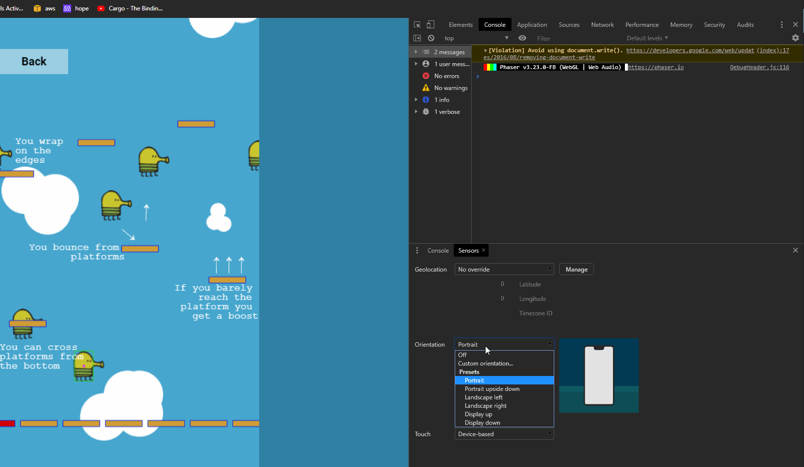

#  

## Jump as high as you can and brag about it!!

<div class="imagesTop" style="display: flex; justify-content: space-around;">


</div>

---

This game is based on [Doodle Jump](https://apps.apple.com/us/app/doodle-jump-insanely-good/id456355158), so I could focus entirely on the development. The whole game was done in a week and here's a quick rundown of how that time was spent:
- The first 2 days I read a bunch of documentation from phaser and followed some of the examples from the phaser website, I listed a few of things I wanted to do:
  1. Wrap player on the X-axis
  2. Endless autogenerated platforms
  3. Gyroscope control
  4. Double Jump
  5. Different types of platforms
  
  But in the end, I got a little bit short on time and had to cut that last part out, the red platform right now it's just an indicator of when the same platforms are being looped

  The platform generation was tricky enough to cost me a whole day, at first I tried to push and pop (add and remove to those not so nerdy) from an array of platforms, but looping the same platforms once they get out of the view resulted in fewer calculations per tick

- The next day I fought against the documentation again, phaser has some really old examples and documentation online, and if you add up the fact that they have 3 different physics engines, looking for help on something specific can be a pain.
- The Fourth Day I mostly did play-tests with my brother, I wasn't happy with how the player movement felt, so we were testing different approximations to how to accelerate the player, and how much control we should have on the air
- The last day I added the linter and made some final tweaks to the style and overall looks of the game, I added a title screen, menu, and some instructions (including this readme :D)
---

# Try it out!!

You want to try it out without any installation? YOU CAN! Just check out the [live version](https://endless-jumper.netlify.app/).

While game __can__ be played on a pc, it was thought to be played on a phone, it uses the accelerometer to move the Doodler, although It was just tested on Chrome and Firefox (both for android... sorry iPhone users :o, you can play on the browser)

YOU CAN EVEN PLAY IT ON FULLSCREEN MODE!! (the icon on the top right, and again only for mobile users)



# Development Setup

This project uses [Yarn 1.22.4](https://classic.yarnpkg.com/en/), and have not been tested with npm, it should work, but I can't say for sure.

Steps: 
- Clone this repo:
```
$ git clone git@github.com:YoseptF/Endless-Jumper.git
```
- Move to the lastest branch:
```
$ git checkout [branch name]
```
- Install the dependencies:
```
$ yarn
```
- Run the developer server:
```
$ yarn start
```

# Build with

- [Phaser](https://phaser.io/phaser3)
- [This biolerplate](https://github.com/crgeary/phaser3-webpack-boilerplate) from [Christopher Geary](https://github.com/crgeary)
- Assets from [LimaSky](http://www.limasky.com/)
- [Webpack](https://webpack.js.org/)
- [FontAwesome](https://fontawesome.com/)
- Icons made by <a href="https://www.flaticon.com/authors/flat-icons" title="Flat Icons">Flat Icons</a> from <a href="https://www.flaticon.com/" title="Flaticon"> www.flaticon.com</a>
- Code from myself [Joseph Flores](https://github.com/YoseptF?tab=repositories)
